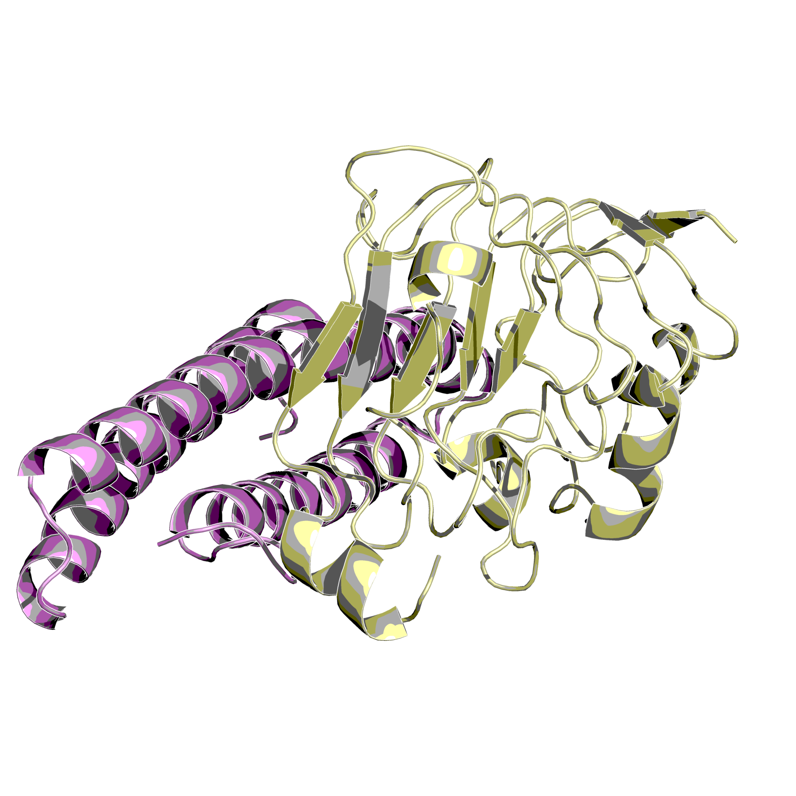
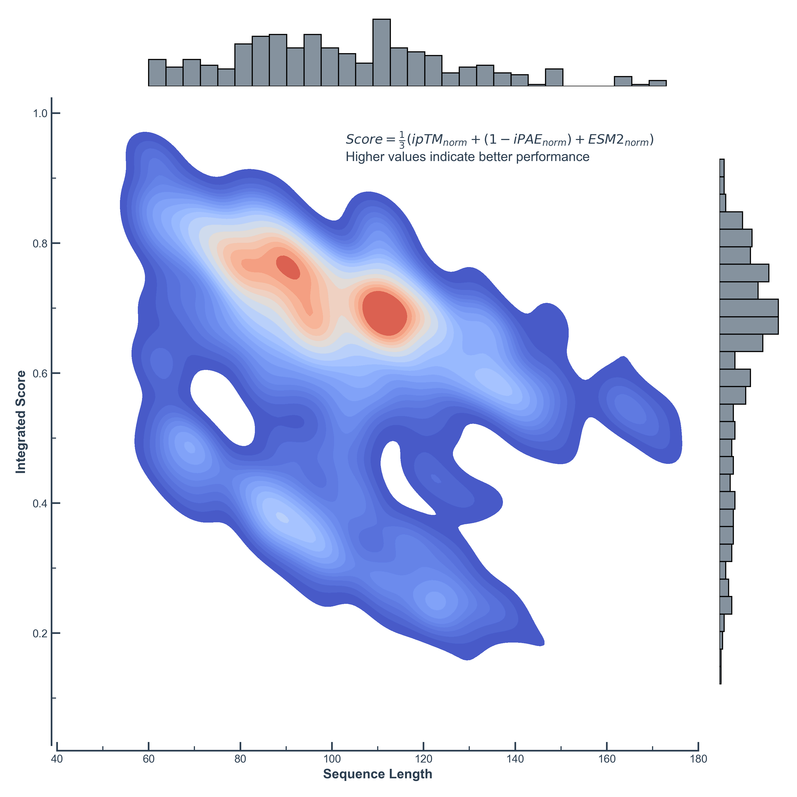

# Adaptyv Bio Protein Design competition


:: 👀 [Adaptyv Bio Protein Design Competition home](https://design.adaptyvbio.com/)


:: submit and wet validation design visualized by [hgbrian/pdb2png](https://github.com/hgbrian/pdb2png)

## Two-Stage Screening considering different archtectures between AlphaFold2 and AlphaFold3 in De Novo Design
I generated over 350 de novo designs using BindCraft, and RSO(corey's biomodal implementation). 
For the BindCraft designs, I explored various conditions, including targeting different regions of Domain III and generating designs without specified hotspots.
The designs underwent a two-stage screening process using ColabFold and the AlphaFold3 server. 
While some designs achieved scores predicted to be within the top 100 of the leaderboard in ColabFold evaluation, they sometimes exhibited lower scores in AlphaFold3 predictions.
(For example, design "EGFR_l170_s387368_mpnn7_model2" shows an AF2 ipTM of 0.89 but an AF3 ipTM of only 0.17, and some designs show a decrease from AF2 ipTM values to AF3 ipTM values ranging from -1.0 to -2.0).

This discrepancy may be attributed to AlphaFold3's diffusion module and modifications to its loss function. 
AlphaFold2 predicts residue-based coordinates and penalizes structural violations. 
At binding interfaces, AlphaFold2's residue-based evaluation focuses on overall backbone placement, which might not fully capture local atomic interactions such as side-chain packing and electrostatic interactions that are important for binding affinity.
These interface issues, which are crucial for actual protein-protein interaction and binding specificity, might go undetected in residue-based evaluation.

In contrast, AlphaFold3's all-atom diffusion model directly predicts atomic coordinates without such constraints, potentially revealing these subtle instabilities at the interface that could affect binding.
Designs that score well in both systems have passed two different types of evaluation criteria - AlphaFold2's residue-level assessment and AlphaFold3's atomic-level prediction - which may increase confidence in their structural predictions.

Although AlphaFold3 is not currently open-source, making this analysis somewhat speculative, if Figures 1-3 in the AlphaFold3 paper are accurate, it would be excellent for evaluating de novo designs. 
Consequently, designs showing strong scores in both ColabFold and AlphaFold3 may indicate greater stability and binding potential.
While AlphaFold3 limits submissions to 20 jobs per day, this was sufficient for conducting two-stage screening (except for EGFR_l61_s456546_mpnn1_model1 and EGFR_l62_s814650_mpnn14_model1).

## submission
```
📊 two-stage screening (colabfold + alphafold3, AF2 ipTM 0.89~0.93 → AF3 ipTM 0.89~0.93)
- EGFR_l114_s689302_mpnn1_model1
- EGFR_l137_s922133_mpnn6_model2
- EGFR_l147_s449248_mpnn1_model2
- EGFR_l110_s478327_mpnn7_model2
- EGFR_l164_s996609_mpnn9_model2
- EGFR_l110_s478327_mpnn6_model1
- EGFR_l84_s528582_mpnn7_model1
- EGFR_l88_s11832_mpnn1_model2

📊　only ColabFold (Alphafold2 + MMseqs2) screening (AF2 ipTM 0.91~0.93 → AF3 ipTM 0.82~0.85)
- EGFR_l61_s456546_mpnn1_model1
- EGFR_l62_s814650_mpnn14_model1

📊 wet validation (3 designs are selected)
- EGFR_l61_s456546_mpnn1_model1
- EGFR_l110_s478327_mpnn7_model2
- EGFR_l88_s11832_mpnn1_model2
```

All my designs (BindCraft) and their evaluation results can be accessed at:
https://wdmr2dwp.nocodb.com/#/nc/view/48433702-4717-474f-8c66-49846d71e4b8


:: Overview of all my designs and their integrated scores (iPAE, ipTM, and ESM2 log-likelihood).

## Useful Resources
Here is helpful information about Adaptyv Bio's protein design competition and protein design in general.
For those new to protein binder design, I recommend checking out the starred (⭐️) GitHub repositories and blog posts first.

### GitHub Repo
- Methods for binder designs
    - [⭐️ BindCraft, User friendly and accurate binder design pipeline](https://github.com/martinpacesa/BindCraft)
    - [biomodals, bioinformatics tools running on modal](https://github.com/hgbrian/biomodals)
    - [RSO, coreyhowe999's modal implementation](https://github.com/coreyhowe999/RSO)
    - [chai-1, SOTA model for biomolecular structure prediction ](https://github.com/chaidiscovery/chai-lab)
    - [ESM-3, frontier generative model for biology](https://github.com/evolutionaryscale/esm)
    - [ESM-2, Evolutionary Scale Modeling](https://github.com/facebookresearch/esm)
    - [⭐️ ColabFold, Making Protein folding accessible to all!](https://github.com/sokrypton/ColabFold)
    - [RFDiffusion, OSS structure generation methods](https://github.com/RosettaCommons/RFdiffusion)
    - [dl binder design, de novo binder designs with DL](https://github.com/nrbennet/dl_binder_design)
    - [ProteinMPNN, structure to sequence](https://github.com/dauparas/ProteinMPNN)
- pLMs and pLLMs
    - [ESM-3, frontier generative model for biology](https://github.com/evolutionaryscale/esm)
    - [ESM-2, Evolutionary Scale Modeling](https://github.com/facebookresearch/esm)
    - [TAPE, Tasks Assessing Protein Embeddings](https://github.com/songlab-cal/tape)
    - [ProteinBERT, pre-trained by ~106M UniRef90 proteins](https://github.com/nadavbra/protein_bert)

### Twitter
- [Jude Wells@_judewells Chai1 optimization](https://twitter.com/_judewells/status/1853805775807758465?s=61&t=QEKbzc4Q_MQOGNrv2bbejg)
- [Corey@design_proteins tried BindCraft](https://twitter.com/design_proteins/status/1849919279790997596?s=61&t=4LW4TKynjsiSiQ9kKfehMg)
- [Anthony Gitter@anthonygitter shared additional wet validation results](https://twitter.com/anthonygitter/status/1848768548480393298?s=61&t=fwFHyeIlZimZW-ZsykLabA)
- [Martin Pacesa@MartinPacesa disucuss round2 competition metrics](https://twitter.com/martinpacesa/status/1851628857792528889?s=61&t=vDTBRNVawlO1Fol8ICoJkA)

## Adaptyv Bio
- GitHub Repo
    - [Round-1 Results](https://github.com/adaptyvbio/egfr_competition_1)
    - [Round-2 competition metrics](https://github.com/adaptyvbio/competition_metrics)
- ⭐️ Official Blog
    - [Protein Optimization 101: Insights from the literature](https://www.adaptyvbio.com/blog/po101)
    - [Protein Optimization 102: Lessons from the protein design competition](https://www.adaptyvbio.com/blog/po102)
    - [Case Study: Benchmarking RFdiffusion generated binders for IL-7Ra](https://www.adaptyvbio.com/blog/rfdiff_il7ra)

## Computational Resources
- [Modal](https://modal.com/)
- [Google Colaboratory](https://colab.google/)
- [KOUKARYOKU DOK](https://www.sakura.ad.jp/koukaryoku-dok/)
- [Lambda GPU Cloud](https://lambdalabs.com/)
- AWS, Azure, GCP (expensive)

### Other Information
- [⭐️ Sequences from Adaptyv Bio’s EGFR Protein Design Competition](https://github.com/agitter/adaptyvbio-egfr)
- [⭐️ Brian Naugthon shared various binder design methods](http://blog.booleanbiotech.com/adaptyv-binder-design-competition.html)
- [Five protein-design questions that still challenge AI (Nature)](https://www.nature.com/articles/d41586-024-03595-9)
- [AlphaFold3の中身の日本語解説 (in japanese)](https://zenn.dev/tonets/articles/dd8c3855eadb2b)
